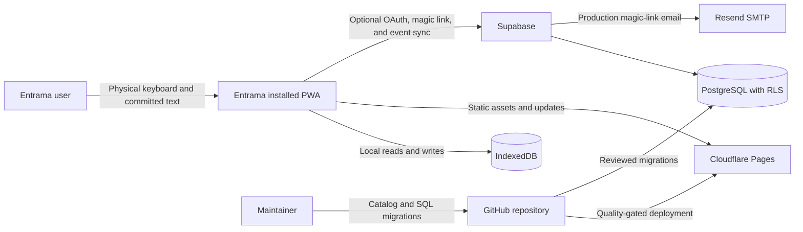
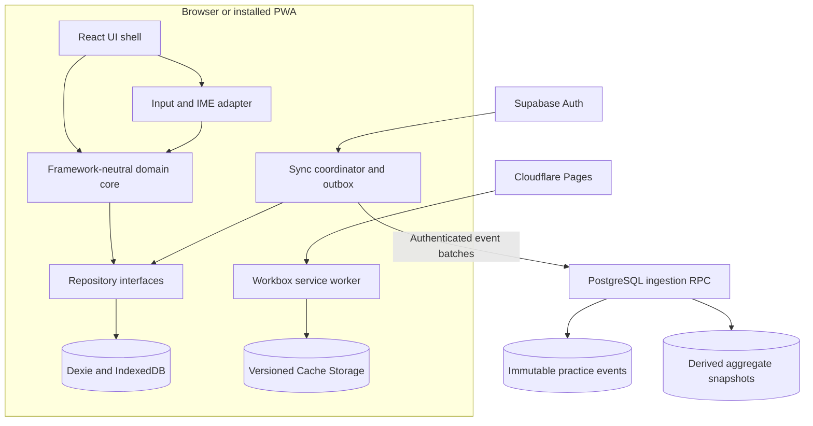
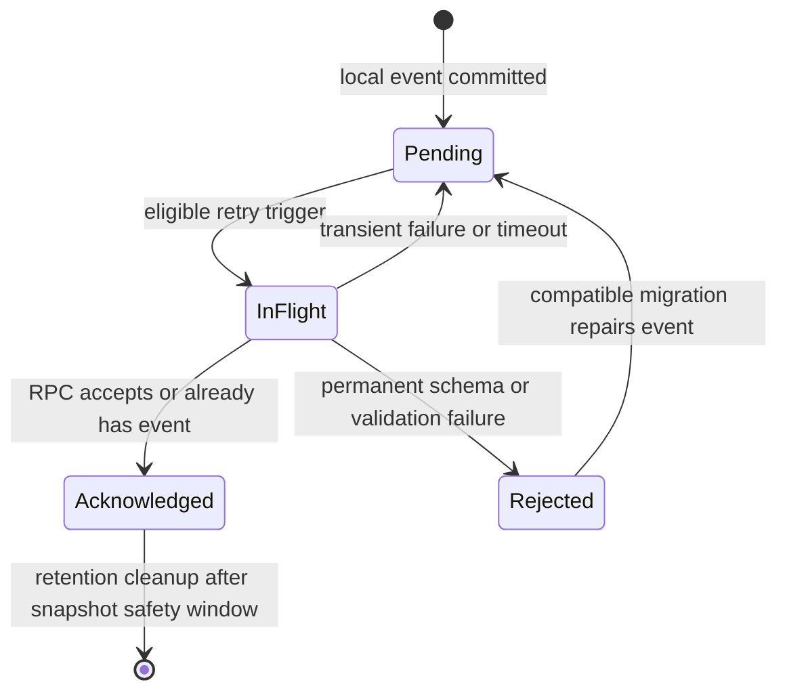

# Entrama MVP Technical Architecture RFC

| Field | Value |
|---|---|
| Status | Accepted for MVP implementation |
| Decision date | 2026-08-11 |
| Scope | Desktop-first offline PWA, optional account sync, curriculum engine, and operations |
| Product requirements | [PRD.md](./PRD.md) |

## Decision Summary

Entrama will be a static Vite 8, React 19, strict TypeScript PWA hosted on Cloudflare Pages. Framework-neutral domain modules will own typing, keyboard layouts, curriculum, statistics, progress, and synchronization. Dexie over IndexedDB is the local source of truth. Supabase Auth and PostgreSQL with RLS form an optional authenticated remote replica; Resend SMTP supports production email magic links.

Synchronization sends immutable compact aggregate practice events through one authenticated, idempotent PostgreSQL RPC. Entrama never uploads each keystroke or raw typed content. The client uses stable event IDs, device IDs and monotonic sequences, set-union merge, a durable outbox, and server-derived snapshots. The architecture intentionally excludes SSR, a custom always-on API, custom auth, realtime, microservices, Kubernetes, PowerSync, and ML for MVP.

## Context

Entrama's dominant workload is a latency-sensitive client-side typing loop. Guest users must practice offline without an account; authenticated users may recover and merge progress across devices. Content is small, curated, deterministic, and repository-versioned. Private progress data is additive and can be represented more safely as immutable aggregate events than as concurrently mutable totals.

The architecture must remain free or low-cost for personal use, portable for open-source forks, and honest about managed free-tier limitations. Product outcomes and claim boundaries remain authoritative in the PRD.

## Goals

- Immediate, correct grapheme feedback under composition, dead keys, and supported layouts.
- Full local guest operation for practice, catalog, preferences, progress, and statistics.
- Deterministic, explainable curriculum selection without ML.
- Optional passwordless identity, recovery, and cross-device convergence.
- Idempotent synchronization that tolerates retries, offline gaps, and duplicate delivery.
- Private-by-default data with RLS on every exposed table.
- Safe PWA installation, caching, schema/catalog updates, and rollback-aware migrations.
- Provider-neutral domain/repository boundaries and portable PostgreSQL migrations.
- Automated domain, browser, E2E, offline, security, and migration verification.

## Non-Goals

- Server rendering, SEO-driven application routes, or server components.
- A bespoke authentication system or password storage.
- Generic realtime replication, collaborative state, or per-keystroke cloud telemetry.
- A custom Node server, microservices, Kubernetes, or always-on API.
- PowerSync or another synchronization service for additive MVP events.
- Machine-learning curriculum ranking or inferred vocabulary mastery.
- One-click self-hosting across every provider.
- Public profiles, rankings, social graphs, or analytics based on raw typing.

## Alternatives Considered

| Alternative | Strength | Decision and rationale |
|---|---|---|
| Vite 8 + React 19 | Direct SPA/PWA tooling, mature component ecosystem, minimal runtime architecture | **Selected.** Best fit for a highly interactive client-only application and framework-neutral core. |
| Next.js | Integrated SSR, routing, server functions, deployment conventions | Rejected for MVP because SSR/server components add deployment and cache boundaries without serving the offline typing core. It remains viable for a separate future public site. |
| Astro with React islands | Excellent content delivery and selective hydration | Rejected for the application core because nearly the entire practice surface is interactive state, reducing the island-model advantage. |
| SvelteKit | Compact reactive UI and good application tooling | Technically viable, but rejected to retain the selected React ecosystem and avoid equivalent-risk framework churn. |
| Firebase/Firestore | Native offline persistence and managed auth | Rejected because same-document last-write-wins semantics, proprietary data/security coupling, and exit costs are worse for this event model. |
| PocketBase/custom API | Simple single binary or complete backend control | Rejected because both introduce server operations; PocketBase is vertically scaled and a custom API duplicates managed auth/database capabilities. |
| PowerSync | Durable local SQLite synchronization | Rejected as unnecessary service and cost complexity for immutable compact aggregate events. Reconsider only if product data becomes relationally complex and generic bidirectional sync is required. |

## System Context



## Container Architecture



## Module Boundaries

| Module | Owns | Must not own |
|---|---|---|
| `typing` | Expected grapheme state, correction policy, timing, unit/block transitions | DOM events, React rendering, remote calls |
| `keyboard-layouts` | Four profile definitions, physical actions, fingers/hands, modifiers, composition instructions, calibration rules | Browser detection certainty or UI state |
| `curriculum` | Schema-validated catalog, eligibility, deterministic ranking, skill estimates, override policy | React, database APIs, vocabulary-mastery claims |
| `statistics` | Accuracy, five-character WPM/pace, errors, duration, trends, held-out analysis | Public comparison or raw text storage |
| `progress` | Profiles, skill state, exposure, completed aggregate events, catalog/algorithm versions | Supabase-specific types |
| `sync` | Provider-neutral adapter contract, outbox state machine, merge/ack protocol | Domain scoring or direct UI rendering |
| `storage-dexie` | IndexedDB repositories, transactions, versioned migrations | Curriculum policy |
| `sync-supabase` | Auth session adaptation and RPC transport | Local source-of-truth semantics |
| `app` | React composition, routing, localization, accessible views | Domain rules duplicated in components |
| `service-worker` | Precache/runtime cache/update lifecycle | IndexedDB business migrations or authenticated data cache |

All domain packages expose strict TypeScript types and pure functions where practical. Zod 4 validates external boundaries: catalog files, imports, persisted migration payloads, RPC responses, and environment configuration. Internal values are not repeatedly reparsed without a trust-boundary reason.

## Input Event and IME Model

Physical guidance and committed text are separate channels:

1. `keydown`/`keyup` provide `KeyboardEvent.code`, modifiers, repeat state, and timing for keyboard visualization and layout telemetry. They do not determine the committed character.
2. A native visually hidden input or textarea receives `beforeinput`, `input`, `compositionstart`, `compositionupdate`, and `compositionend`.
3. While composition is active, intermediate text may update accessible guidance but cannot advance the domain state.
4. Final committed text is normalized to Unicode NFC and segmented into extended grapheme clusters with `Intl.Segmenter`, with a tested fallback if support requires it.
5. Each committed grapheme is compared to the normalized expected grapheme. Paste, multi-grapheme insertions, deletion, replacement, and unexpected input types follow an explicit reject-or-sequential-consume policy tested per browser.
6. A wrong committed grapheme records one error against the expected position and does not advance. Subsequent correct input advances.
7. Raw input values and per-key streams stay in ephemeral memory and are never persisted or uploaded.

The layout profile maps an expected grapheme to one or more display actions, such as dead key plus vowel or Option/Shift combinations. Calibration verifies observable mappings rather than trusting platform sniffing or `Keyboard.getLayoutMap()`, which is best-effort capability only.

## Curriculum Data and Validation

The repository stores versioned data files validated in CI and at application boundaries. A unit includes stable ID, English surface/sense, Spanish surface/sense, locale, item type, typing features per profile, vocabulary features, internal bands, usefulness, provenance, source license, reviewer state, and content version.

Catalog releases are immutable. Corrections create a new version and a compatibility mapping when a stable item is superseded. The original curriculum is recommended under CC BY 4.0; imported data requires compatible terms and item-level attribution.

## Curriculum Scoring and Selection

### Hard Eligibility

A candidate is eligible only when all predicates pass:

```text
typingLower(state) <= typingDifficulty(candidate, profile) <= typingUpper(state)
vocabularyLower(state) <= vocabularyDifficulty(candidate) <= vocabularyUpper(state)
usefulnessLower(state) <= usefulness(candidate) <= usefulnessUpper(state)
requiredActions(candidate) subset-of introducedOrTargetActions(state)
contentReview(candidate) = approved
locale(candidate) is compatible with profile preference
```

Hard gates prevent a high score on one objective from compensating for an unacceptable value on another. Internal bands overlap to avoid cliffs. Temporary easier/harder mode shifts the eligibility window; it does not mutate the automatic estimate merely because the user selected it.

### Initial Feature Formulas

All inputs are normalized to `[0,1]`. These formulas are **uncalibrated MVP engineering hypotheses**, not validated pedagogy. Coefficients and thresholds must be versioned and evaluated against the personal pilot before adjustment.

```text
TypingDifficulty T =
  0.16 * unmasteredLayoutActions
+ 0.10 * reachDifficulty
+ 0.08 * rowTransitionDifficulty
+ 0.14 * sameFingerTransitionRate
+ 0.08 * lowAlternationOrLongHandRuns
+ 0.07 * repeatedGraphemeDifficulty
+ 0.08 * normalizedLength
+ 0.06 * spacesAndWordBoundaries
+ 0.10 * modifierLoad
+ 0.13 * compositionAndAccentLoad

VocabularyDifficulty V =
  0.20 * inverseFrequencyAndDispersion
+ 0.18 * normalizedCEFR
+ 0.15 * inverseCommunicativeUtility
+ 0.10 * abstractness
+ 0.12 * senseAmbiguity
+ 0.08 * falseFriendRisk
+ 0.07 * nonTransparentCognateFactor
+ 0.06 * localeSpecificity
+ 0.04 * ageAppropriatenessRisk
```

Usefulness is a separate hard-gated score derived initially from `0.45 * communicativeUtility + 0.35 * frequencyAndDispersion + 0.20 * phraseCoverage`, also uncalibrated. Keeping it separate prevents easy but low-value items from dominating.

### Ranking Eligible Candidates

```text
Rank =
  0.30 * typingNeedMatch
+ 0.18 * vocabularyNeedMatch
+ 0.18 * reviewDue
+ 0.14 * usefulness
+ 0.10 * underexposedSkillCoverage
+ 0.06 * catalogDiversity
+ 0.04 * deterministicNovelty
- 0.12 * recentItemRepetitionPenalty
- 0.08 * recentPatternRepetitionPenalty
```

The positive terms are normalized before penalties. Ties are resolved by a stable hash of `(profileId, catalogVersion, algorithmVersion, candidateId, selectionOrdinal)`, not runtime randomness. The selector stores catalog, feature, score, and algorithm versions with each aggregate event for replay and analysis.

### Skill Progression

Typing skill estimates use successful opportunities, corrected errors, and pace only for the relevant layout action. Initial thresholds are conservative, versioned heuristics; evidence does not establish a universal key order or exact mastery threshold. The sequence begins with lowercase/basic movement, then spaces/phrases, Spanish accents/`ñ`/`ü`, Shift/capitals, punctuation, then `¿?¡!` and harder combinations. Spanish forms remain correctly spelled throughout.

Vocabulary state records exposure and practice only. No selector field is named or interpreted as vocabulary mastery. Post-MVP recall tests require a separate model and product decision.

## Local Data Model

Dexie is accessed only through repository interfaces. IndexedDB migrations retain every historical version declaration needed to upgrade existing installations.

| Store | Key/indexes | Purpose |
|---|---|---|
| `profiles` | `id`, `kind`, `accountId?`, `updatedAt` | Active guest/account-local profile and lifecycle state |
| `preferences` | `profileId`, `locale`, `layoutProfileId` | UI language, theme, keyboard/stats visibility, reduced-motion preference, difficulty mode |
| `calibrations` | `id`, `[profileId+layoutProfileId]`, `completedAt` | Calibration result and layout definition version; no raw calibration text |
| `catalogs` | `version` | Validated catalog metadata and compatibility state |
| `catalogUnits` | `[catalogVersion+unitId]`, bands, review state | Reviewed content and derived features for offline selection |
| `skillStates` | `[profileId+layoutProfileId+skillId]` | Automatic typing estimate and evidence counters |
| `exposures` | `[profileId+unitId]`, `lastPracticedAt` | Practiced-item aggregates without learned/mastered semantics |
| `practiceEvents` | `eventId`, `[profileId+deviceId+sequence]`, `completedAt` | Immutable compact aggregate events |
| `outbox` | `eventId`, `state`, `nextAttemptAt` | Durable pending/in-flight/acknowledged synchronization state |
| `snapshots` | `[profileId+snapshotVersion]` | Rebuildable local aggregate cache |
| `devices` | `deviceId`, `nextSequence` | Random stable device identity and transactionally allocated sequence |
| `migrations` | `migrationId` | Data/catalog migration receipts and recovery metadata |

A `practiceEvent` represents a completed unit or bounded block, not a keystroke. It contains IDs/versions, start/end monotonic-derived duration, committed grapheme count, corrected-error counts by typing skill, aggregate timing buckets, layout profile, and held-out marker. It does not contain the user's raw input, clipboard content, or a key-by-key timeline.

Persistence is batched at unit or short block boundaries. The active domain state remains in memory; a page lifecycle flush is best-effort, so only already committed aggregate boundaries are guaranteed.

## Remote PostgreSQL Model

| Table | Key fields | Access and behavior |
|---|---|---|
| `profiles` | `user_id PK`, `created_at`, `deleted_at?` | One private application profile per authenticated identity |
| `devices` | `(user_id, device_id) PK`, `max_sequence`, metadata | Private device sequence tracking; metadata excludes fingerprinting fields |
| `practice_events` | `(user_id, event_id) PK`, unique `(user_id, device_id, sequence)` | Immutable inserts only; compact validated payload columns/JSONB |
| `aggregate_snapshots` | `(user_id, snapshot_version) PK`, `through_event_count`, aggregate payload | Server-derived, replaceable cache; never authoritative over events |
| `profile_preferences` | `user_id PK`, version, payload, updated tuple | Optional portable preferences with deterministic conflict tuple |
| `account_operations` | `(user_id, operation_id) PK`, type, status | Idempotent guest claim, export, and deletion workflow receipts |
| `schema_metadata` | version PK, compatibility fields | Service/schema compatibility; not user-private |

Catalog files ship statically and are not duplicated into the user database in MVP. SQL migrations create constraints that reject invalid IDs, negative counts, oversized payloads, unknown event versions, and sequence misuse.

### RLS and RPC Security

- Enable RLS on every table in an exposed schema, including tables thought unreachable from the UI.
- Authenticated policies restrict rows to `user_id = auth.uid()`; anonymous users receive no progress-table access.
- The ingestion RPC derives `user_id` from `auth.uid()` and never accepts a trusted user ID from the client.
- Revoke RPC execution from `anon`. Prefer `SECURITY INVOKER`; if a narrowly reviewed `SECURITY DEFINER` function is required, fix `search_path`, fully qualify objects, validate auth, minimize grants, and test privilege escalation.
- The Supabase service-role key is never shipped to the browser. Only the public client key is present client-side.
- Event rows are immutable to browser roles; no update/delete grants exist. Account deletion uses a separately authorized operation.
- Apply request/payload limits and server-side rate controls. Protect email magic-link initiation with provider limits and CAPTCHA after abuse signals.

## Sync Protocol

### State Machine



### Upload Contract

1. The client transactionally allocates `(deviceId, sequence)`, creates a UUID/ULID-style `eventId`, stores the immutable event, and adds it to the outbox.
2. On startup, successful authentication, `online`, visibility regain, and a bounded while-open timer, the coordinator batches pending events by count and byte limit.
3. The authenticated RPC validates version, ownership context, limits, event structure, and intra-batch uniqueness.
4. Within one database transaction it inserts with conflict-safe semantics, advances each device's observed sequence without assuming contiguous delivery, derives affected aggregates, and returns acknowledged/rejected IDs plus server compatibility metadata.
5. The client marks acknowledgements locally; pending events remain durable until acknowledged or explicitly deleted after an irreversible-loss warning. Timeouts are retried with identical IDs.
6. Background Sync may request another attempt where available, but correctness never depends on it.

### Idempotency and Merge Examples

**Duplicate retry:** device A sends event `e7`, the response is lost, and A retries. The unique `(user_id,event_id)` constraint converts the second delivery into the same acknowledgement; aggregate derivation includes `e7` once.

**Two offline devices:** A creates `{e7,e8}` and B creates `{e2}` with independent device sequences. Upload order may be `e2,e8,e7`. Set union yields `{e2,e7,e8}` and snapshots are derived from all three; no last-write-wins total overwrites another device.

**Same guest claimed twice:** a stable claim operation ID and stable local event IDs make the second claim a replay. Existing events acknowledge; missing events insert. Local guest data is not deleted until the account state and acknowledgements are durable.

**Preference conflict:** portable preferences are mutable and use a deterministic `(logicalVersion, updatedAt, deviceId)` ordering, with field-level merge only where explicitly defined. Local display preferences may remain device-local to avoid needless conflict.

Server snapshots are rebuildable and include a derivation version. If they disagree with immutable events, events win and snapshots are regenerated.

## Authentication and Guest Migration

- Supabase Auth providers in MVP: Google, GitHub, and email magic link. No password flow or cloud anonymous guest accounts.
- Guest IDs are local random identifiers, never identity claims.
- OAuth redirect and magic-link return routes restore the pending local profile and start an idempotent claim after a verified authenticated session exists.
- Identity linking must prevent two product profiles for the same Supabase user. Provider-email collisions follow Supabase's verified identity behavior and are tested rather than guessed in client code.
- Claim uploads immutable guest events under the authenticated RPC; remote and local sets merge by event ID.
- Failure leaves the guest profile and outbox intact. A successful claim records a local receipt before switching the active profile.
- Before sign-out, detect pending/in-flight account events and, when online, attempt a bounded sync that cannot wait indefinitely.
- Quarantine remaining events durably by account, without usable auth credentials; the fresh guest cannot access them, and sync resumes only after re-authentication as the same account. Offer export before destructive local removal.
- Remote sign-out and token removal may proceed; purge guest-accessible account snapshots, outbox views, and private responses. Delete unacknowledged events only after a clear warning and explicit confirmation of irreversible deletion.
- Account deletion requires recent authentication where supported, deletes all application rows and the auth identity through a privileged managed workflow, purges local account data, and activates a fresh guest.
- Export produces a versioned JSON archive of personal events, aggregates, preferences, and metadata with checksums; raw typing is absent because it was never collected.

Initial authentication and magic-link delivery/completion require network. Existing locally cached account practice may continue offline, but the UI must clearly distinguish unverified local access from successful synchronization.

## PWA Caching, Updates, and Offline States

Use `vite-plugin-pwa` with Workbox `injectManifest` to keep service-worker policy explicit.

| Resource | Strategy | Notes |
|---|---|---|
| Hashed application shell | Precache | Versioned by build; offline launch dependency |
| Versioned catalog files | Cache-first with integrity/version validation | Retain currently compatible catalog until replacement is validated |
| Navigation | App-shell fallback | Only application routes; provide deterministic offline response |
| Public static assets | Stale-while-revalidate or cache-first by mutability | Bound cache count and age |
| Supabase auth/RPC | Network only | Never cache private API responses in Cache Storage |
| Fonts | Self-host and precache where licensing permits | Avoid runtime availability dependency |

### Safe Update Protocol

1. A new service worker installs and waits; it does not call unconditional `skipWaiting` during active practice.
2. The application detects the waiting version and compares app, catalog, local schema, and event compatibility ranges.
3. If practice is active, defer activation until the next block boundary or explicit pause.
4. At a safe boundary, flush completed aggregates, activate the worker, migrate IndexedDB transactionally, validate the target catalog, and reload/rehydrate.
5. On migration/catalog failure, preserve the prior compatible catalog/cache when technically possible, stop new practice writes, and present recovery/export guidance.
6. Cache names include build/catalog compatibility versions; cleanup happens only after the active client confirms safe transition.

### User-Visible Offline States

- `offline-ready`: all practice dependencies are available locally.
- `offline-pending-sync`: practice works and account events are queued.
- `online-syncing`: bounded batch upload is in progress without blocking typing.
- `network-required-auth`: sign-in initiation or magic-link completion cannot continue offline.
- `storage-at-risk`: persistence was denied or quota/eviction signals require export guidance.
- `update-ready`: update waits for a safe boundary.

Request persistent storage after demonstrated value, not before first practice. Continue to support export/import because persistence requests are not guarantees.

## Performance Architecture and Budgets

These are **engineering targets**, not measured guarantees. They must be verified on a representative mid-range laptop in production builds and revised from evidence.

| Measure | MVP target |
|---|---|
| Key/input event to visual grapheme feedback | p95 <= 16 ms, p99 <= 32 ms while practice is foregrounded |
| Main-thread synchronous work per committed grapheme | p95 <= 4 ms |
| Long tasks during active practice | No task > 50 ms attributable to routine typing; fewer than 1 per 5 minutes overall |
| Animation frame stability | >= 55 FPS at p95 during block transitions on reference hardware |
| Warm repeat launch to actionable practice | p75 <= 2 s, p95 <= 5 s offline or online |
| Cold cached install launch | p75 <= 3 s on reference broadband/hardware |
| Initial compressed application JS | Target <= 180 KiB gzip; hard review at 250 KiB gzip excluding versioned catalog |
| Initial compressed critical CSS | <= 30 KiB gzip |
| Pilot catalog payload | <= 150 KiB compressed for ~90 units; lazy/versioned expansion thereafter |
| Unit-boundary local persistence transaction | p95 <= 25 ms and never awaited by grapheme rendering |
| Sync batch | <= 100 events or 128 KiB request body, whichever occurs first |
| Runtime memory after 30 minutes practice | Target <= 100 MiB with no sustained growth trend |

The keystroke hot path updates only in-memory domain state and the smallest render surface. Persistence, statistics aggregation, sync, and block preparation are scheduled outside immediate feedback. Virtual keyboard and live statistics subscribe to narrow selectors rather than the entire practice state. Avoid allocation-heavy full-block transformations per grapheme. Use compositor-safe transforms/opacity for purposeful transitions and disable nonessential motion under `prefers-reduced-motion`.

## Privacy, Security, and Threat Model

| Threat | Control |
|---|---|
| Cross-user data access | RLS on all exposed tables, `auth.uid()` ownership, negative policy tests |
| Forged user ID in RPC | Derive identity from authenticated context; do not accept ownership parameter |
| Stolen service key | Never expose it in browser/build; managed secret only in privileged operations |
| RPC privilege escalation | Minimal grants, no anon execution, invoker rights by default, fixed `search_path` if definer is justified |
| Duplicate/replayed uploads | Stable event IDs and unique constraints; immutable idempotent ingestion |
| Event flooding or oversized payloads | Batch/field limits, quotas, rate limits, authenticated abuse monitoring |
| Email abuse | Resend production SMTP, provider rate limits, CAPTCHA after risk signals, neutral responses to enumeration |
| XSS and token theft | CSP, no unsafe HTML, dependency review, secure Supabase session defaults, short-lived OAuth state |
| Signed-out private data leakage | Never cache auth/RPC responses; isolate credential-free pending events by account and purge guest-accessible private replicas on sign-out |
| Raw typing surveillance | Do not persist/upload raw input or per-keystroke streams; aggregate locally at bounded completion |
| Browser storage loss | Persistence request, export/import, optional sync, explicit risk state |
| Supply-chain compromise | Lockfile review, Dependabot/Renovate policy, GitHub Actions least privilege, reproducible quality gates |

No unnecessary behavioral telemetry is permitted. Security logs may contain request ID, coarse timestamp, RPC outcome, schema version, batch count/bytes, and pseudonymous account/device identifiers with bounded retention. They must not contain catalog surfaces, typed strings, OAuth tokens, email addresses in application logs, or per-key timing.

## Observability

- Client diagnostics are opt-in for development/support and locally inspectable.
- Production service metrics cover deployment health, service-worker version adoption, sync success/error classes, queue age, RPC latency, rejected schema versions, and aggregate event volume.
- Product validation metrics are computed from private local or synchronized aggregate events: launch-to-practice, accuracy, WPM/pace, corrected errors, duration, and held-out item markers.
- Error reports scrub user content, URLs containing auth fragments, tokens, email, and raw input values.
- There is no session replay, key logger, heatmap, fingerprinting, or third-party behavioral analytics in MVP.

## Testing Strategy

| Layer | Tool and coverage |
|---|---|
| Domain unit | Vitest: grapheme progression, correction policy, WPM, deterministic selector, hard bands, formulas, skill state, event aggregation, merge properties |
| Property/fixture | Vitest: Unicode NFC equivalence, deterministic replay, idempotent set union, catalog invariants, event serialization |
| Browser integration | Vitest Browser Mode: hidden input, composition lifecycle, focus recovery, IndexedDB transactions/migrations, service-worker messaging where feasible |
| End-to-end | Playwright: onboarding, practice, wrong/correct input, auto-block advance, preferences, OAuth stubs/magic link, guest claim, offline restart, sync retry, update boundary, export/delete |
| Database/security | Migration tests plus pgTAP or equivalent: constraints, RLS positive/negative cases, anon denial, immutable rows, RPC replay/concurrency |
| Accessibility | Automated axe checks plus keyboard-only and screen-reader manual passes; reduced motion and contrast verification |
| Performance | Production-build browser traces and budget assertions on representative hardware; long-session leak test |
| Manual OS/layout | Windows US International, Windows Latin American QWERTY, macOS US International, macOS Latin American QWERTY |

The manual matrix covers calibration, dead keys, accents, `ñ`, `ü`, Shift, punctuation, `¿?¡!`, composition cancellation, key repeat, browser zoom, and at least Chromium plus the platform's other major browser. No automated synthetic event is accepted as proof of physical layout correctness.

## Deployment and CI

GitHub Actions quality gates run formatting, linting, strict type checking, Zod catalog validation, license/provenance checks, domain tests, browser tests, production build, bundle budgets, Playwright smoke tests, SQL migration tests, RLS tests, and dependency/security scanning. Pull requests cannot deploy production migrations directly.

Cloudflare Pages hosts immutable static builds with preview deployments. Supabase hosts Auth and PostgreSQL. Resend supplies configured production SMTP for magic links. Environments use separate projects/credentials; browser builds contain only public configuration. SQL migrations remain ordered and reviewed in the repository, and deployment records bind app build, catalog version, and database compatibility range.

## Backup and Recovery

- Supabase Free may pause inactive projects and does not provide managed backups; do not treat it as the sole durable copy.
- Run scheduled encrypted logical PostgreSQL dumps to independent storage at a cadence justified before public accounts launch; retain multiple generations.
- Test restoration into an isolated project regularly and record recovery time, integrity counts, RLS state, and RPC smoke results.
- The client remains usable locally during backend pause or recovery and resumes idempotent outbox sync afterward.
- Export/import gives users an additional portable copy but is not the operator backup strategy.
- Catalog and SQL migration history are recoverable from the repository and release artifacts.
- Document a recovery runbook for provider outage, accidental deletion, bad migration, compromised credentials, and project pause.

Initial operational targets before broader public launch: daily logical dump, 30-day rolling retention, quarterly restore exercise, RPO <= 24 hours for remote-only account data, and RTO <= 24 hours. Local unsynced data follows device durability and is outside server RPO.

## Migrations and Versioning

Version independently:

- Application build and service-worker cache schema.
- Dexie database schema.
- Catalog and catalog item schema.
- Layout definitions and calibration version.
- Curriculum features, formulas, and algorithm.
- Practice event wire format.
- PostgreSQL schema, RPC contract, and snapshot derivation.
- Export format.

Every client build declares compatible ranges. Additive migrations precede code that requires them; destructive cleanup occurs only after compatibility telemetry and rollback windows. Dexie upgrades are transactional and preserve old version declarations. PostgreSQL migrations use expand/migrate/contract where data or old clients coexist. Event migrations preserve immutable originals or produce explicitly linked derived versions rather than rewriting history silently.

## Open Source, Licensing, and Fork Topology

- Recommend Apache-2.0 for application code and CC BY 4.0 for original curriculum data.
- Maintain separate `LICENSE`/notice boundaries and machine-readable item provenance for third-party data.
- A local-only fork works without Supabase, Resend, or cloud credentials.
- A connected fork owns and pays for its own managed Supabase project, OAuth applications, SMTP provider, Cloudflare deployment, backups, and legal/privacy obligations.
- Advanced self-hosting can document PostgreSQL/Auth substitutions through repository and sync interfaces, but MVP does not promise one-click deployment.
- Keep SQL migrations standard where practical and the sync domain interface provider-neutral to enable exit to another PostgreSQL provider.
- `Entrama` remains a working name pending legal, trademark, domain, package, and handle review before public launch.

## Cost and Scaling Triggers

The personal MVP targets managed free tiers, but availability and limits may change. Record current provider terms before launch rather than hard-coding pricing in architecture.

| Trigger | Response |
|---|---|
| Supabase inactivity pause affects use | Move to paid availability or another managed PostgreSQL provider; local practice remains continuous |
| Magic-link deliverability or provider limits fail | Review Resend tier/configuration, abuse controls, and alternative SMTP provider |
| Database/event growth raises query or backup cost | Partition/archive immutable events by time only after measured need; preserve export and snapshots |
| RPC p95 latency exceeds 500 ms or sustained errors exceed 1% | Profile indexes/batch derivation, decouple snapshot refresh if safe, and scale managed database |
| Outbox queue age exceeds 24 hours for online authenticated users | Investigate auth expiry, compatibility rejection, service availability, and retry policy |
| Catalog reaches 250-300 units or payload budget | Split versioned catalog chunks by eligibility/profile while retaining offline completeness for active bands |
| Product requires non-additive shared data or large relational offline queries | Re-evaluate a dedicated sync engine such as PowerSync; do not adopt preemptively |
| Operations exceed personal maintenance capacity | Fund managed backups/monitoring before adding custom services |

## Rollout Plan

1. **Domain prototype:** prove grapheme/IME behavior, four layout definitions, deterministic selection, and Dexie migration strategy without remote dependency.
2. **Local personal alpha:** complete mandatory onboarding, ~90 reviewed units, statistics, offline install/update, export/import, and four-profile manual testing.
3. **Private account beta:** enable providers, production SMTP, idempotent RPC, RLS tests, guest claim, sign-out purge, deletion, backups, and restore exercise.
4. **Four-week validation:** run the PRD protocol with held-out content and collect only approved aggregates/self-report.
5. **Public open-source pilot:** complete name/legal review, licenses/attribution, threat review, privacy documentation, operational alerts, and fork guidance.

Each stage has a rollback to local-only operation. Account sync does not become a prerequisite for practice.

## Rejected Complexity

- SSR and server components for a client-resident practice loop.
- Realtime subscriptions for private additive events.
- Cloud anonymous users for guests.
- Per-keystroke ingestion, raw text logs, and session replay.
- Mutable cross-device totals as synchronization authority.
- A generic sync platform before the event model demonstrates need.
- ML ranking without volume, labels, calibration, or explainability.
- Microservices, Kubernetes, custom auth, and a custom always-on API.
- An admin panel for a repository-reviewed catalog.
- Automatic service-worker activation during active practice.

## Unresolved Implementation Details

These are explicit decisions still required; they are not placeholders:

- Select the exact hidden-control accessibility pattern after screen-reader testing across target browsers.
- Define paste and multi-grapheme insertion behavior, including whether practice rejects all paste or consumes valid graphemes sequentially.
- Fix initial hard-band thresholds, skill mastery heuristics, and held-out selection after catalog scoring review.
- Choose the pilot's leading Spanish locale and translation-variant policy.
- Specify the compact event JSON/column split and maximum per-field cardinalities before SQL migration authoring.
- Decide whether server snapshot refresh runs synchronously inside ingestion or through a managed scheduled/queued mechanism after measured batch cost.
- Select the account-deletion privileged mechanism available within the final Supabase deployment without introducing a custom always-on API.
- Establish production dump storage, encryption key custody, retention, and restore ownership.
- Confirm exact supported browser versions and reference performance hardware before release gating.

## Decision Log

| Date | Decision | Rationale |
|---|---|---|
| 2026-08-11 | Use Entrama as working product name | Best current fit for interwoven bilingual continuous practice; still requires legal/availability review. |
| 2026-08-11 | Select Vite 8 + React 19 + strict TypeScript | Matches a highly interactive static PWA without SSR complexity. |
| 2026-08-11 | Keep domain modules framework-neutral | Protects testability, hot-path performance, and provider/framework exit. |
| 2026-08-11 | Make IndexedDB the local source of truth | Guest-first offline practice must not depend on backend availability. |
| 2026-08-11 | Use Supabase as optional replica | Managed passwordless auth, PostgreSQL/RLS, low initial operations, and credible SQL exit path. |
| 2026-08-11 | Synchronize immutable aggregate events | Set union and stable IDs provide idempotent convergence without raw typing or mutable-total conflicts. |
| 2026-08-11 | Use deterministic hard-gated curriculum selection | Prevents objective compensation and remains explainable without ML. |
| 2026-08-11 | Separate typing mastery from vocabulary exposure | Visible guided copying cannot verify vocabulary recall or retention. |
| 2026-08-11 | Use `injectManifest` and safe update boundaries | Explicit cache policy is needed and updates must not interrupt active practice. |
| 2026-08-11 | Separate Apache-2.0 code and CC BY 4.0 original data | Clarifies reuse, attribution, and fork obligations. |

## References

Primary and authoritative sources informing implementation and later verification:

- Vite documentation: <https://vite.dev/guide/>
- React 19 documentation: <https://react.dev/reference/react>
- TypeScript strict checking: <https://www.typescriptlang.org/tsconfig/strict.html>
- Vite PWA `injectManifest`: <https://vite-pwa-org.netlify.app/guide/inject-manifest>
- Workbox precaching and service-worker lifecycle: <https://developer.chrome.com/docs/workbox/modules/workbox-precaching> and <https://web.dev/learn/pwa/update>
- IndexedDB: <https://developer.mozilla.org/docs/Web/API/IndexedDB_API>
- Dexie version upgrades: <https://dexie.org/docs/Version/Version.upgrade()>
- Storage persistence and eviction: <https://developer.mozilla.org/docs/Web/API/Storage_API/Storage_quotas_and_eviction_criteria>
- Background Sync availability: <https://developer.mozilla.org/docs/Web/API/Background_Synchronization_API>
- UI Events keyboard code: <https://www.w3.org/TR/uievents-code/>
- Input Events: <https://www.w3.org/TR/input-events-2/>
- Unicode normalization: <https://unicode.org/reports/tr15/>
- Unicode text segmentation: <https://unicode.org/reports/tr29/>
- Supabase Auth: <https://supabase.com/docs/guides/auth>
- Supabase passwordless email and production SMTP: <https://supabase.com/docs/guides/auth/auth-email-passwordless> and <https://supabase.com/docs/guides/auth/auth-smtp>
- Supabase Row Level Security: <https://supabase.com/docs/guides/database/postgres/row-level-security>
- PostgreSQL row security: <https://www.postgresql.org/docs/current/ddl-rowsecurity.html>
- PostgreSQL function security: <https://www.postgresql.org/docs/current/sql-createfunction.html>
- Supabase backups and free-plan behavior: <https://supabase.com/docs/guides/platform/backups> and <https://supabase.com/docs/guides/platform/billing-on-supabase>
- Cloudflare Pages: <https://developers.cloudflare.com/pages/>
- Zod 4: <https://zod.dev/v4>
- Vitest Browser Mode: <https://vitest.dev/guide/browser/>
- Playwright offline emulation: <https://playwright.dev/docs/api/class-browsercontext#browser-context-set-offline>
- WCAG 2.2: <https://www.w3.org/TR/WCAG22/>
- `prefers-reduced-motion`: <https://www.w3.org/WAI/WCAG22/Techniques/css/C39>
- Retrieval practice evidence boundary: Roediger and Karpicke (2006), <https://doi.org/10.1111/j.1467-9280.2006.01693.x>
- CEFR Companion Volume: <https://www.coe.int/en/web/common-european-framework-reference-languages/cefr-descriptors>
- Apache License 2.0: <https://www.apache.org/licenses/LICENSE-2.0>
- Creative Commons Attribution 4.0: <https://creativecommons.org/licenses/by/4.0/legalcode>

References support technical choices and research boundaries; uncalibrated formulas and performance budgets remain Entrama engineering decisions requiring measurement.
